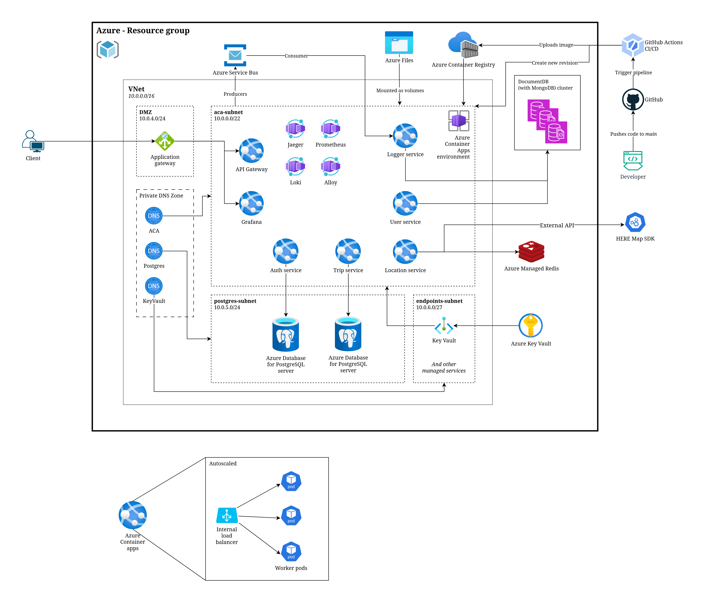
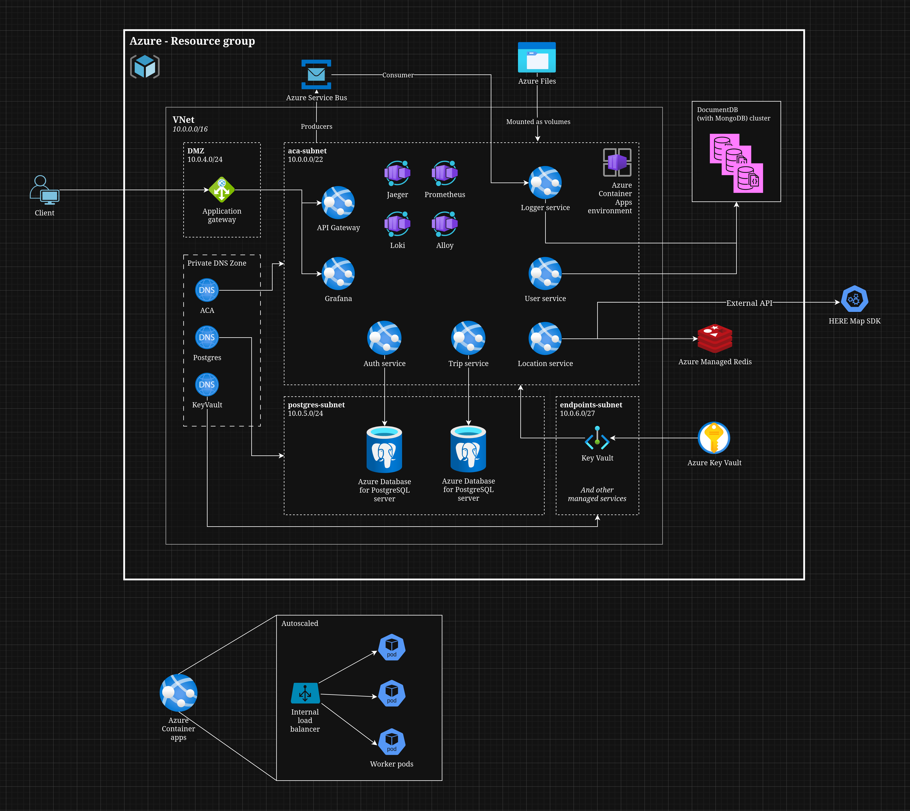

# Final ~~duet~~ report

Heads-up: We uses Azure instead of AWS to:

1. explore our options
2. Azure provides 100$ of free credit for students
3. better looking portal

Aside from these, most of the concepts should be similar or have a competitor alternative between 2 service, like ACA=Fargate, EC2=VM,...

Keep in mind, generally Azure is more invested in their own MS SQL Server and Document DB services, while AWS is more invested in MySQL, PostgreSQL so hyperscale service offerings between 2 companies in these areas might differ.

And we also uses `opentofu` instead of `terraform` for IaC because licensing and Linux Foundation backing. However, there should be no difference running our tf project with both tools. Locally I symlinked `terraform` to `tofu` and everything works fine.

## App diagram - dev's story

We have the following services in our app skeleton:

- API Gateway: Act as HTTP-to-gRPC translator, and route requests to the correct service, and can have more functionality added. This is separate to avoid lock-in, since we can move to another service easily, and devs can test new functionality locally with `compose`.
- Logger service: All other services if need to save data or analytics will produce to the message queue, then `logger service` will consume from it, process if needed, and save to MongoDB store for later use. This is a PoC for a BigData pipeline.
- User service: Handle users
- Trip service: Handle trip progress, trip status, etc.
- Location service: Handle location-related worloads, like driver location, user location tracking, find nearby drivers, etc. As it needs high data throughput, frequent updates, low latency (near-real-time), and doesnt need to persist data, it uses in-memory database (Redis).
- Authentication service: handle user credentials and authentication operations. Does NOT do authorization, as we use stateless JWT.

Cross services communication will use gRPC, with ProtoBuf as the serialization method to reduce data serialization overhead but might sacrifice dev experience.

## System architecture diagram

Short outline:

- Custom Virtual networks (not fully-managed networking), with private ACA dedicated subnet, private Postgres subnet, and a public DMZ subnet to handle Internet traffic.
- Services will be deployed in **Azure Container Apps**
- RabbitMQ in local dev will be replaced by **Azure Service Bus**
- Redis will use **Azure Managed Redis**
- Secrets will be stored in **Azure Key Vault** and connected and mounted into ACA
- MongoDB will use **DocumentDB with MongoDB**
- Persistent volumes in ACA will mount from **Azure Files**.
- Public traffic will go through **Azure Application Gateway**, put inside DMZ subnet.
- Private DNS zones will be used to resolve names of managed services inside VNet.
- Location service will call to **HERE Maps SDK**, an external Map API.

## Core ADRs

### Security - Full managed vs Virtual Network

We can either:
- make a fully VNet-less infrastructure, where all components has a FQDN attached to it, accessible from either public Internet, private Azure, or both. Or,
- make a custom network, with subnets and proper ACLs to restrict access to resources.

We decided to go with proper custom virtual network, since exposing your databases and services directly to the Internet (even with firewalls and service endpoints) is still a pretty bad idea security-wise.

We deployed a DMZ tiered network scheme, where only a small subnet (DMZ) is actually exposed to the Internet through a Gateway with restricted ACLs, and all other services either live in a private subnet, or is managed by Azure elsewhere in the datacenter region, but connected to the virtual network through a service endpoint or a private endpoint through private link.

We use a basic 10.0.0.0/16 address space, and currently have these subnets:

- aca-subnet (10.0.0.0/22): This gives 10 bit of host address, 1019 hosts precisely, for our pods. This subnet is delegated to our computing solution (Azure Container Apps, see later).
- DMZ (10.0.4.0/24, **public**): The public subnet for services that is public.
- postgres-subnet (10.0.5.0/24): Subnet delegated to our PostgreSQL solution.
- endpoints-subnet (10.0.6.0/27): Subnet for private endpoints from Azure managed services, so that we have a private connection directly to the resource through an IP address. May or may not be used since private endpoints does have extra costs, will be touched on later.

### Compute - Azure Container Apps

App services and all auxiliary containers will be deployed as an **Azure Container Apps** (ACA).

This is a managed K8s solution, comparable to AWS Fargate, to automate and abstract away the control plane and config work. It also supports scale-to-zero and other features that K8s has, since it's K8s under the hood.

Each services deployed inside ACA environment (the entire cluster) have auto-scaling, auto-healing and load-balancing built in.

A service container is deployed as an ACA, in an ACA environment, running one or many replicas of that container, and have a load balancer to distribute load to these replicas.

### Persistent storage - Azure Files

### Data plane - Postgres

### Data plane - Redis Cache

### Data plane - MongoDB

### Message queue - Azure Service Bus

### Secret management - Azure Key Vault

This one is a simpler choice. With Azure Container Apps, you get an environment setup out of the box, like `docker-compose` env block, but the config is finicky, and spread out across the apps so it's harder to manage. We need a centralized keystore to quickly adjust, revoke and/or change the secrets in case of credentials leaks and similar.

Most keystore's feature sets are pretty close to each other, so picking any is fine functionality-wise. The only decision-makers lies in pricing and ease-of-use.

Azure Key Vault integrates directly into ACA so setup is very minimal, with no code changes to the underlying apps, so we get a very cloud-agnostic, no-lock-in solution. As such, there's not really a need for alternatives here.

### Azure Application Gateway

A gateway to public Internet. Provides load-balancing (with auto-scaling built in), traffic routing, and a WAF to filter out bad traffic.

Since we already have a dedicated API Gateway service, we only use traffic routing to split our domain into `api.*` for the API, and `monitor.*` for Grafana. 

However, WAF is an optional feature, as it provides higher security in exchange for ~50% of request performance, so we either need to double our price by scaling out, or accept the performance lost. As such, we don't use it.

### No NAT Gateway

Usually, a VNet would have a NAT Gateway to handle egress traffic (connections that started from within our infra) too, but since we don't need the static IP (HERE SDK does not require IP whitelisting) and the floor monthly cost is significantly higher than default ACA egress (around 2000$ for a study case we found), we decided NOT to include it.

## Modules

The project will primarily do Module D and E:
- Module D: Observability
- Module E: FinOps and Automation

## Module D: Observability

## Module E: FinOps and Automation

### Automation - CI/CD

**GitHub Actions** is used as the CI/CD platform, simply because CI/CD itself is just a task runner that run a shell script when a webhook is triggered, usually through Git repo push actions to a branch. Since the project is already hosted on GitHub, GitHub Actions is easy to add. It allows custom runner too, so no dependent costs, and can migrate easily anytime since it's just CI/CD.

Each services (a folder in the `services` folder) that need to be deployed will have its own pipeline defined. If any files in and only in that folder changes, it will trigger a build run, which `docker build` that image, then pushes to ACR, then trigger updates in ACA to create a new revision with `azure-cli`.

A revision is like an app update, config update or similar that doesn't change underlying infrastructure. Usually it's used to update our apps, like in this case, or even do A/B testing or multiple API versions, etc.

Rolling updates will be automatically done on revision change by ACA (it's just K8s) so no service disruption.

### Automation - IaC OpenTofu modules

The IaC codebase is splitted into modules for easier re-use, and structured in industry best practice.

We have (at least) these modules:
- networking: vnets, acls, dns,...
- aca-infra: define ACR, ACA environments,...
- aca-service: create an ACA service that runs inside ACA environment created with `aca-infra`
- postgres
- redis
- resource-group
- azure-files
- service-bus
- key-vault
- documentdb
- app-gw

Then combined in the top-level module `main.tf`.

In case a new service is added, just add a new block of module `aca-service` into the top-level module with configs for it.

We do have the problem of chicken-and-egg when provisioning ACR and ACA, since ACR is newly-deployed, and have no images on it yet, but ACA needs a pullable image to provision, so this would fails.

https://www.mytechramblings.com/posts/how-to-push-a-container-image-into-acr-using-te

We picked the build-inline option, which involves using `null_resource` to trigger a shell command to use `az acr build` to build the images and pushes to ACR after creating the ACR but before creating ACA so that it has a valid image.

This is hacky, but the other option is to use a dummy image and update later with CI/CD, which can overwrite when we do `tf apply` so in my opinion even more hacky. This is the state of Terraform. This is not a good state. But what can we do?

### Cost calculation and optimization
We used the **Azure Pricing Calculator** to estimate our monthly costs.

#### Calculation Assumptions (10k users):
- Peak concurrent users: 1,500-2,500 (15-25% of total users) - higher during peak hours
- Peak concurrent trips: 300-500 concurrent trips (3-5% of users are on an active trip)
- Request rate: 80-150 requests/user/day (higher due to location updates)
- Data transfer: 8-15GB/day.
- Region: Southeast Asia
- During peak hours, 10k users simultaneously, each user sending at least 1 request per second on average (for location updates). Peak hours last 2 hours in the afternoon and 2 hours in the morning. Thus, during each peak hour, the application must handle 10,000 requests per second.

#### Networking

- **Application Gateway**: $195.64/month at Standard V2 tier, including 730 fixed gateway hours, 1 compute unit, 1000 persistent connections, 1 mb/s throughput, and 100 GB data transfer.  
  Note: Can be scaled.  
  Scale from 1 compute - 2,500 Persistent Connections - Throughput 2.22 mb/s  
  Scale to 10 compute - 25,000 Persistent Connections - Throughput 22.2 mb/s  
  Estimated Price: $219.00/month

- **Azure DNS (DNS ACA)**: $40.50/month, including 1 hosted DNS zone and 100 million DNS queries.

- **Azure DNS (DNS Postgres)**: $40.50/month, including 1 hosted DNS zone and 100 million DNS queries.

- **Load Balancer (Internal load balancer)**: Free at Basic tier.

- **Azure DNS (DNS Key Vault)**: $40.50/month, including 1 hosted DNS zone and 100 million DNS queries.

#### Azure Container Apps

- **Location Service**: $52.35/month, Consumption plan, 0 million requests, 2 vCPUs, 4 GiB memory, 1 minimum replica.

- **Trip Service**: $105.12/month, Consumption plan, 0 million requests, 2 vCPUs, 8 GiB memory, 1 minimum replica.

- **API Gateway**: $642.24/month, Consumption plan, 1500 million requests, 4 vCPUs, 8 GiB memory, 1 minimum replica.

- **Auth Service**: $52.35/month, Consumption plan, 0 million requests, 2 vCPUs, 4 GiB memory, 1 minimum replica.

- **User Service**: $0.00/month, Consumption plan, 0 million requests, 2 vCPUs, 4 GiB memory.

- **Logger Service**: $0.00/month, Consumption plan, 0 million requests, 0.5 vCPU, 2 GiB memory.

- **Grafana**: $0.00/month, Consumption plan, 0 million requests, 0.5 vCPU, 1 GiB memory.

- **Observability stack**: $31.54/month, Consumption plan, 0 million requests, 1 vCPU, 2 GiB memory, 1 minimum replica.

Total for Azure Container Apps: $886.25/month.

Note: The calculations above are not entirely accurate as they are from the Azure calculator and do not account for internal task computations by the services (The current calculating assume that every service have been scaled to 0 due to the "pay as you go" plan). The formula for computing costs per service is:  
- vCPU cost: Number of vCPUs × active seconds × $0.00002822 per vCPU-s  
- Memory cost: Number of GiB memory × active seconds × $0.00000332 per GiB-s
- Due to the Resources: The first 180,000 vCPU-seconds each month are free.

##### Recalculated Costs with Assumptions
Assuming each service has at least 1 active instance for 18 hours per day (64,800 seconds per day, or 1,944,000 seconds per month), recalculated using the formula above, accounting for free tiers (180,000 vCPU-seconds and 360,000 GiB-seconds per month per ACA).

Service vCPU allocations:  
- Location Service: 2 vCPUs  
- Trip Service: 2 vCPUs  
- API Gateway: 4 vCPUs  
- Auth Service: 2 vCPUs  
- User Service: 2 vCPUs  
- Logger Service: 0.5 vCPUs  
- Grafana: 0.5 vCPUs  
- Observability stack: 1 vCPU  

Total vCPUs across all services: 14.5  

Service memory allocations:  
- Location Service: 4 GiB  
- Trip Service: 8 GiB  
- API Gateway: 8 GiB  
- Auth Service: 4 GiB  
- User Service: 4 GiB  
- Logger Service: 2 GiB  
- Grafana: 1 GiB  
- Observability stack: 2 GiB  

Total memory across all services: 33 GiB  

Total vCPU-seconds per month: 14.5 × 1,944,000 = 28,188,000  
Total GiB-seconds per month: 33 × 1,944,000 = 64,152,000  

Free vCPU-seconds per ACA per month: 180,000  
Free GiB-seconds per ACA per month: 360,000  

Per service costs (after subtracting free per ACA):  

- **Location Service** (2 vCPUs, 4 GiB): vCPU-s = 3,888,000; Billable vCPU-s = 3,888,000 - 180,000 = 3,708,000; vCPU cost = $104.67; GiB-s = 7,776,000; Billable GiB-s = 7,776,000 - 360,000 = 7,416,000; Memory cost = $24.60; Total: $129.27  
- **Trip Service** (2 vCPUs, 8 GiB): vCPU-s = 3,888,000; Billable = 3,708,000; vCPU cost = $104.67; GiB-s = 15,552,000; Billable = 15,192,000; Memory cost = $50.44; Total: $155.11  
- **API Gateway** (4 vCPUs, 8 GiB): vCPU-s = 7,776,000; Billable = 7,596,000; vCPU cost = $214.47; GiB-s = 15,552,000; Billable = 15,192,000; Memory cost = $50.44; Total: $264.91  
- **Auth Service** (2 vCPUs, 4 GiB): vCPU-s = 3,888,000; Billable = 3,708,000; vCPU cost = $104.67; GiB-s = 7,776,000; Billable = 7,416,000; Memory cost = $24.60; Total: $129.27  
- **User Service** (2 vCPUs, 4 GiB): vCPU-s = 3,888,000; Billable = 3,708,000; vCPU cost = $104.67; GiB-s = 7,776,000; Billable = 7,416,000; Memory cost = $24.60; Total: $129.27  
- **Logger Service** (0.5 vCPUs, 2 GiB): vCPU-s = 972,000; Billable = 972,000 - 180,000 = 792,000; vCPU cost = $22.37; GiB-s = 3,888,000; Billable = 3,888,000 - 360,000 = 3,528,000; Memory cost = $11.71; Total: $34.08  
- **Grafana** (0.5 vCPUs, 1 GiB): vCPU-s = 972,000; Billable = 792,000; vCPU cost = $22.37; GiB-s = 1,944,000; Billable = 1,944,000 - 360,000 = 1,584,000; Memory cost = $5.26; Total: $27.63  
- **Observability stack** (1 vCPU, 2 GiB): vCPU-s = 1,944,000; Billable = 1,944,000 - 180,000 = 1,764,000; vCPU cost = $49.79; GiB-s = 3,888,000; Billable = 3,528,000; Memory cost = $11.71; Total: $61.50  

Total recalculated active cost: $958.25/month (after free tiers).

#### Database

- **Azure Database for PostgreSQL (db auth service)**: $538.31/month, Flexible Server, General Purpose, D4ds v6 (4 vCores), 128 GiB storage, 1000 IOPS, with High Availability.

- **Azure Database for PostgreSQL (db trip service)**: $538.31/month, Flexible Server, General Purpose, D4ds v6 (4 vCores), 128 GiB storage, 1000 IOPS, with High Availability.

- **Azure DocumentDB (MongoDB, db logger service)**: $107.74/month, M10 cluster, 3 Shards, 128 GB storage, without High Availability.

- **Azure DocumentDB (MongoDB, db user service)**: $271.12/month, M20 cluster, 3 Shards, 128 GB storage, without High Availability.

- **Azure Managed Redis (db location service)**: $794.24/month, Compute Optimized, 2 x X3 instances, with High Availability.

Total for Database: $2,249.72/month.

Note: We understand the importance of user data, so we always have data backup in case of bad situations. At the same time, the 2 databases for trip service and location service need to be always ready at all times to support users booking trips, so we chose High Availability (the other 2 databases do not have high availability).

#### Additional Azure Services

- **Azure Service Bus**: $100.00/month, Basic tier, 2000 million messaging operations.

- **Azure Key Vault**: $6.00/month, Vault with 2,000,000 operations.

Total for Additional Azure Services: $106.00/month.

#### Module E Total Cost

- **Networking**: $317.14/month (Application Gateway $195.64, Azure DNS $121.50, Load Balancer $0.00)
- **Azure Container Apps**: $958.25/month (18 hours per day)
- **Database**: $2,249.72/month
- **Additional Azure Services**: $106.00/month

**Total Estimated Monthly Cost**: $3,631.11/month

#### Azure Pricing Calculator References
- Networking: https://azure.com/e/5689822e50e446cb87bd831f55edd0a1
- Azure Container Apps: https://azure.com/e/7cc01f411f674392b92729da5129515c
- Database: https://azure.com/e/3a1155332a6746c7b3d6fae464c0df67
- Additional Services: https://azure.com/e/c92b0f63e6564abb92a6a77b155f26b8
